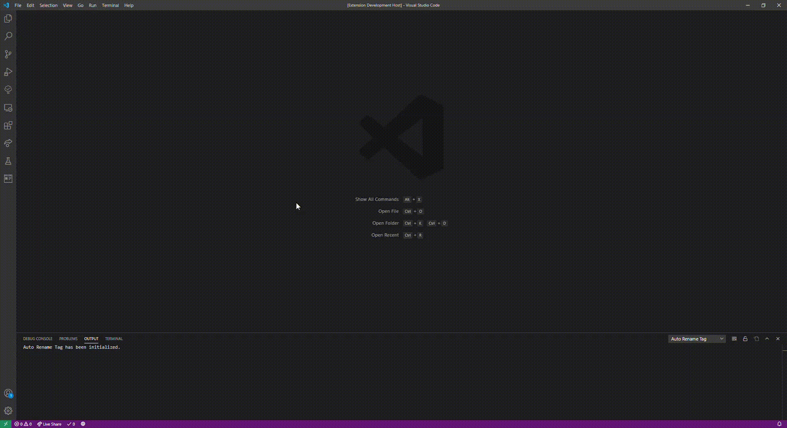

# Lorem Ipsum Generator for VSCode

## Table of Contents:
- [Features](#Features)
- [Extension Settings](#Extension-Settings)
- [Known Bugs](#Known-Bugs)
- [Release Notes](#Release-Notes)
- [Changelog](https://github.com/MrAwesomeRocks/vscode-lorem-ipsum/blob/master/CHANGELOG.md)

## Features
Generating Lipsum text into a file:

Generating and copying Lipsum text:

## Extension Settings

None so far, but some may be added in the future.

<!---
For example:

This extension contributes the following settings:

* `myExtension.enable`: enable/disable this extension
* `myExtension.thing`: set to `blah` to do something
--->

## Known Bugs

None so far, but feel free to go to the [bug tracker](example.com) to report any bugs that you find.

## Release Notes

### 1.0.0

Initial release, can generate Lipsum, generate Lipsum to clipboard, and contains a couple of snippets.

